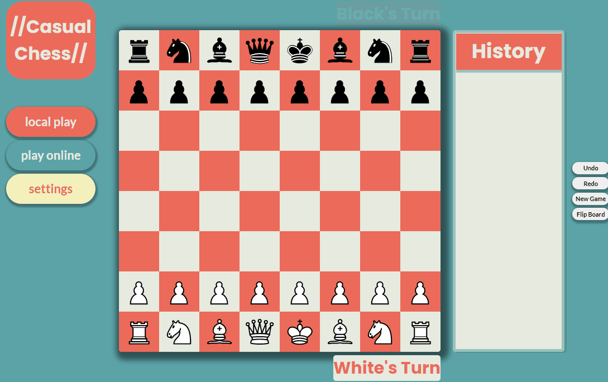

# Chess on the Web

This is a single-page web application that allows users to play chess. Users can play with locally or online anonymously with other players.

## Demo

## Technical Parts

This is a full-stack application created using:

* [React](https://reactjs.org/)
* [Express](http://expressjs.com/)
* [MongoDB](https://www.mongodb.com/)
* [Socket-io](https://socket.io/)

This app also uses a hand-crafted chess engine which allows for: promotion, castling, en passant, check/mate, and drawing.

